# practice2_report


* ```ls -lh датафайлы```  
  
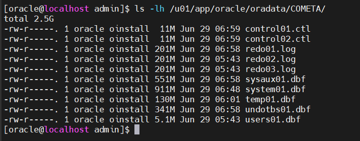

* ```ls -lh файлы параметров```  
  
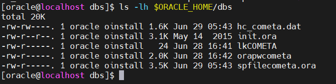

* ```ls -lh управляющие файлы```  

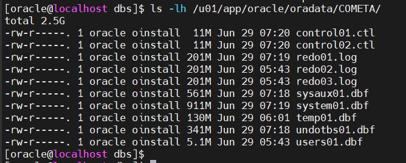

* ```ls -lh alert-лог```  

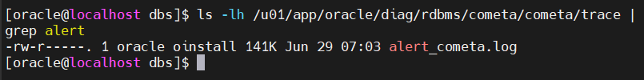

* ```lsnrctl status```  

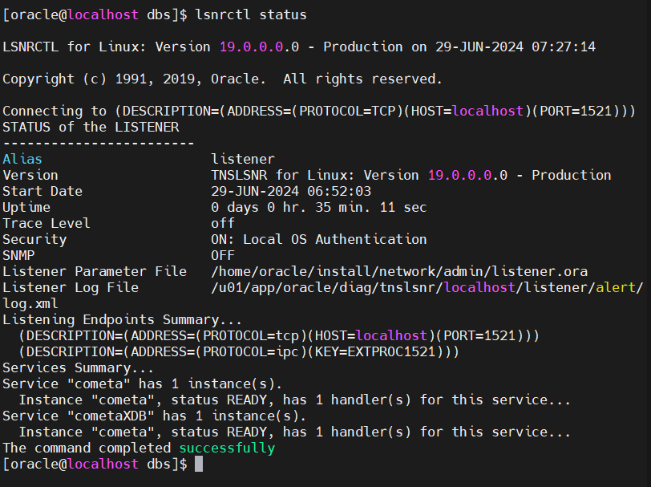

* ```env | grep ORA```  

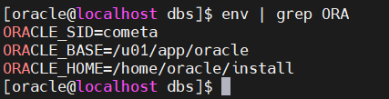

* ```sqlplus -s / as sysdba```
    * ```SET LINESIZE 230```
    * ```select name, created, open_mode, DATABASE_ROLE from v$database;```  
  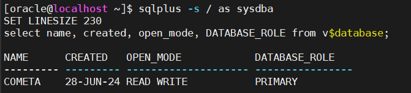
    * ```select VERSION_FULL, status, DATABASE_STATUS, INSTANCE_ROLE from v$instance;```  
  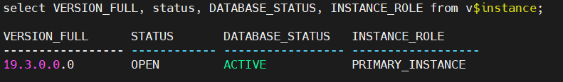
    * ```select * from DBA_ROLE_PRIVS where GRANTED_ROLE='DBA';```  
 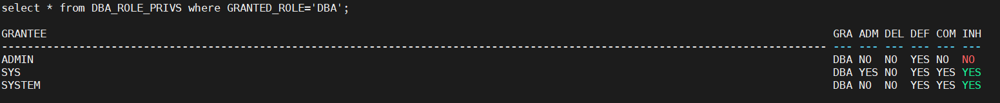
    * ```desc ADMIN.TABLE1;```  
  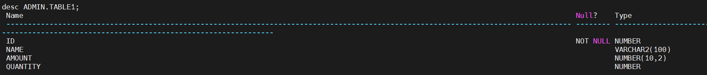
    * ```desc ADMIN.TABLE2;```  
  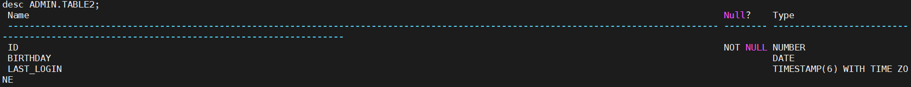
    * ```select * from ADMIN.TABLE1;```  
  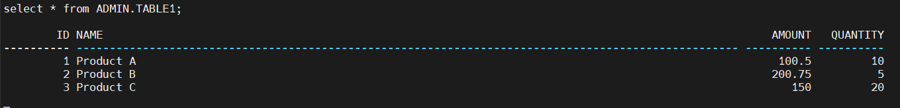
    * ```select * from ADMIN.TABLE2;```  
  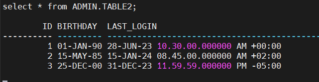
  
